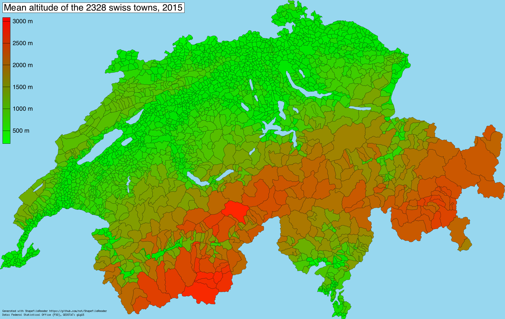
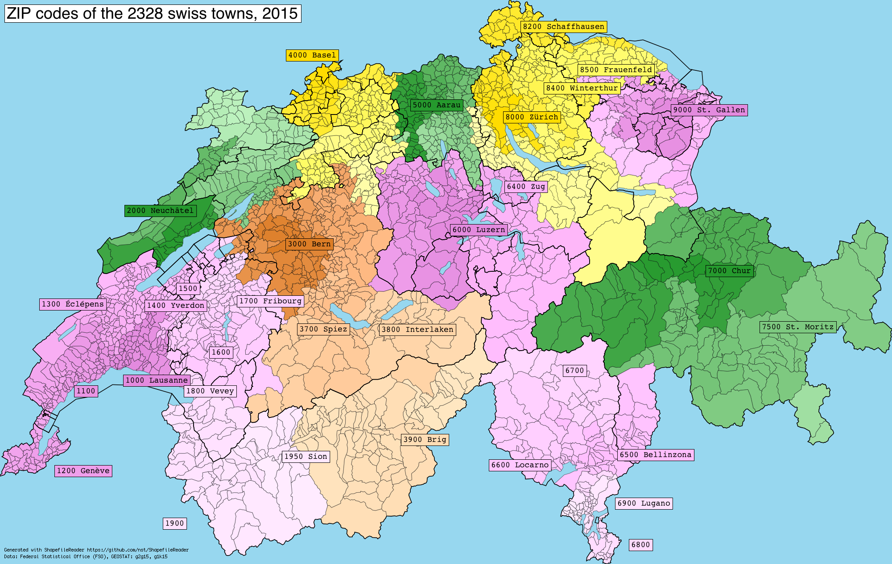

# ShapefileReader
__A shapefile reader in Swift__

__Description__

Reads data from files in [Shapefile](https://en.wikipedia.org/wiki/Shapefile) format.

__API Overview__

ShapefileReader is the only object you instantiate.

Internally, it builds the three following objects, depending on the available auxiliary files:
- `SHPReader` to read the shapes, ie the list of points
- `DBFReader` to read the data records associated with the shapes
- `SHXReader` to read the indices of the shapes, thus allowing direct access

Most usages of `ShapefileReader` will remain like:

```swift
guard let sr = ShapefileReader(path: "g1g15.shp") else { assertionFailure() }

// iterate over both shapes and records
for (shape, record) in sr.shapeAndRecordGenerator() {
    // record is [AnyObject]

    for points in shape.partPointsGenerator() {
        // draw polygon with [CGPoint]
    }
}
```

DBF API

```swift
// if dbf file exists
if let dbf = sr.dbf {
    // number of records
    let n = dbf.numberOfRecords
    
    // fields description
    print(dbf.fields)
    
    // iterate over records
    for r in dbf.recordGenerator() {
        // ...
    }
    
    // access a record by index
    print(dbf[1847])
}
```

    [[DeletionFlag, C, 1, 0], [GMDNR, N, 9, 0], [GMDNAME, C, 50, 0], [BZNR, N, 9, 0], [KTNR, N, 9, 0], [GRNR, N, 9, 0], [AREA_HA, N, 9, 0], [X_MIN, N, 9, 0], [X_MAX, N, 9, 0], [Y_MIN, N, 9, 0], [Y_MAX, N, 9, 0], [X_CNTR, N, 9, 0], [Y_CNTR, N, 9, 0], [Z_MIN, N, 9, 0], [Z_MAX, N, 9, 0], [Z_AVG, N, 9, 0], [Z_MED, N, 9, 0], [Z_CNTR, N, 9, 0]]  
    [5586, Lausanne, 2225, 22, 1, 4138, 534438, 544978, 150655, 161554, 538200, 152400, 371, 930, 670, 666, 585]

SHX API

```swift
// if index file exists
if let shx = sr.shx {
    // access a shape by index
    if let offset = shx.shapeOffsetAtIndex(2) {
    	if let (nextIndex, shape) = shp.shapeAtOffset(offset) {
	        // use shape   	
    	}
    }
}
```

or more simply

```swift
let shape = sr[2]
```

__Implementation Details__

- shape points are CGPoint arrays
- record are arrays of Int, Double, Bool or String (no NSDate, no optionals)
- random access in files and enumerators are used each time it is possible
- most of time, code will crash when files do not match the specs, feel free to open an issue an join the offending files

__Tests and Drawing__

The project comes with a unit test target.

Also, it comes with `BitmapCanvas` and its subclass `BitmapCanvasShapefile` which will generate the following PNG file.

You just need to change the path at the beginning of the `draw()` function in `main.swift` according the project's location.

<a href="img/switzerland_altitude.png"></a>

<a href="img/switzerland_zip.png"></a>

__TODO__

Handle projection files, eg. from http://www.gadm.org/download.

